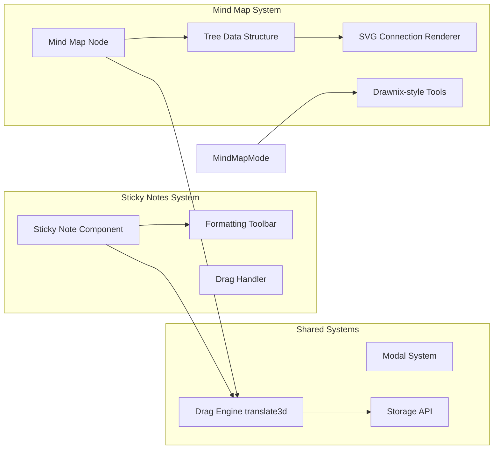

# Developer Conduct & Architecture Guide

## Project Overview

**Sticky Notes & Mind Map Application** - A dual-mode productivity tool combining sticky notes for quick thoughts with a Drawnix-style mind mapping interface for visual brainstorming.

### Tech Stack
- **Frontend**: Vanilla JavaScript (ES6+), HTML5, CSS3
- **Storage**: LocalStorage API
- **Graphics**: SVG for mind map connections, Canvas for drawing
- **Architecture**: Component-based with state management

---

## Table of Contents

1. [System Architecture](#system-architecture)
2. [Flow Control Diagrams](#flow-control-diagrams)
3. [Data Lineage](#data-lineage)
4. [Component Structure](#component-structure)
5. [Development Guidelines](#development-guidelines)
6. [Best Practices](#best-practices)

---

## System Architecture

### High-Level Overview


### Component Architecture



---

## Flow Control Diagrams

### 1. User Creates a Sticky Note


### 2. User Drags a Sticky Note


### 3. Mind Map Node Connection Rendering


### 4. Mode Switching Flow


---

## Data Lineage

### Example: Tracking a Sticky Note from Creation to Storage

```mermaid
graph TB
    Start([User Clicks Add Note]) --> Generate[Generate Unique ID<br/>note-timestamp-random]
    Generate --> CreateObject[Create Note Object<br/>{id, x, y, text, color, timestamp}]
    CreateObject --> CloneTemplate[Clone HTML Template]
    CloneTemplate --> SetAttributes[Set Dataset.id<br/>Set Position left, top<br/>Set Background Color]
    SetAttributes --> AppendDOM[Append to stickyBoard]
    AppendDOM --> PushState[Push to state.notes array]
    PushState --> SaveStorage[saveToStorage]

    SaveStorage --> Serialize[JSON.stringify state.notes]
    Serialize --> LocalStorageWrite[localStorage.setItem<br/>enhancedStickyNotes]
    LocalStorageWrite --> Persisted[(Data Persisted)]

    Persisted --> Reload[Page Reload]
    Reload --> LoadStorage[loadFromStorage]
    LoadStorage --> Retrieve[localStorage.getItem<br/>enhancedStickyNotes]
    Retrieve --> Parse[JSON.parse]
    Parse --> Iterate[For each note in array]
    Iterate --> Reconstruct[Reconstruct HTML<br/>from saved data]
    Reconstruct --> RestoreDOM[Append to stickyBoard]
    RestoreDOM --> RestoreState[Restore to state.notes]
    RestoreState --> Display([Note Displayed])

    style Start fill:#e1f5ff
    style Display fill:#e1f5ff
    style Persisted fill:#ffe1e1
    style LocalStorageWrite fill:#ffe1e1
```

### Mind Map Node Data Flow

```mermaid
graph LR
    subgraph "In-Memory Structure"
        Tree[MindMapNode Tree<br/>Root → Children]
        Root[Root Node<br/>id, text, level:0]
        Child1[Child Node<br/>id, text, level:1]
        Child2[Child Node<br/>id, text, level:1]
    end

    subgraph "Serialization"
        Serialize[serializeMindMapTree]
        JSON[JSON Object<br/>{id, text, level, children:[]}]
    end

    subgraph "Storage"
        LocalStorage[localStorage<br/>enhancedMindMapTree]
    end

    subgraph "Deserialization"
        Deserialize[deserializeMindMapTree]
        Reconstruct[Reconstruct Tree Structure<br/>Parent-Child Relationships]
    end

    Tree --> Root
    Root --> Child1
    Root --> Child2
    Tree --> Serialize
    Serialize --> JSON
    JSON --> LocalStorage
    LocalStorage --> Deserialize
    Deserialize --> Reconstruct
    Reconstruct --> Tree
```

---

## Component Structure

### Sticky Note Component


### Mind Map Component


### Tool System


---

## Development Guidelines

### Code Organization

```
sticky-notes/
├── index.html              # Main HTML structure
├── styles.css              # All styles (component-based sections)
├── app.js                  # Main application logic
│   ├── State Management    # Lines 1-27
│   ├── DOM Elements        # Lines 29-60
│   ├── Initialization      # Lines 62-114
│   ├── Mode Switching      # Lines 116-144
│   ├── Modal System        # Lines 146-178
│   ├── Sticky Notes        # Lines 180-380
│   ├── Drawnix Tools       # Lines 384-570
│   ├── Mind Map System     # Lines 572-960
│   ├── Drag & Drop         # Lines 1091-1169
│   ├── Drawing System      # Lines 1152-1210
│   ├── Storage             # Lines 1247-1344
│   └── Event Listeners     # Lines 1346-1530
├── docs/                   # Documentation
├── .claude/                # Claude AI project files
└── tests/                  # Playwright test suites
```

### State Management Pattern

```javascript
// Centralized state object
const state = {
    currentMode: 'sticky',      // UI state
    notes: [],                  // Data state
    mindMapTree: null,          // Data state
    draggedNode: null,          // Interaction state
    rafScheduled: false         // Performance state
};
```

**Rules**:
1. All state modifications go through the state object
2. Call `saveToStorage()` after state changes
3. Never mutate state directly in event handlers
4. Use state for single source of truth

### Event Handling Pattern

```javascript
// Good: Centralized event handling
function setupEventListeners() {
    document.addEventListener('mousemove', handleGlobalNodeDragMove);
    document.addEventListener('mouseup', handleGlobalNodeDragEnd);
}

// Bad: Multiple listeners per element
// ❌ Don't do this
nodes.forEach(node => {
    document.addEventListener('mousemove', handler); // Creates N listeners!
});
```

### Drag & Drop Best Practices

1. **Use translate3d for GPU acceleration**
   ```javascript
   element.style.transform = `translate3d(${x}px, ${y}px, 0)`;
   ```

2. **Use RAF flag pattern to prevent overdraw**
   ```javascript
   if (!state.rafScheduled) {
       state.rafScheduled = true;
       requestAnimationFrame(() => {
           render();
           state.rafScheduled = false;
       });
   }
   ```

3. **Store offsets, not absolute positions**
   ```javascript
   const startX = e.clientX;
   const elementX = parseInt(element.style.left);
   // Later: newX = elementX + (e.clientX - startX);
   ```

---

## Best Practices

### Performance

1. **Minimize DOM Manipulation**
   - Batch DOM updates
   - Use DocumentFragment for multiple insertions
   - Cache DOM queries

2. **Use RequestAnimationFrame**
   - For animations and visual updates
   - Implement RAF flag pattern
   - Cancel pending frames when needed

3. **Optimize Event Listeners**
   - Use event delegation where possible
   - Remove listeners when components unmount
   - Use passive listeners for scroll/touch events

### Code Quality

1. **Naming Conventions**
   - Functions: `camelCase` (e.g., `createNote`)
   - Classes: `PascalCase` (e.g., `MindMapNode`)
   - Constants: `UPPER_SNAKE_CASE` (e.g., `MAX_ZOOM`)
   - Private functions: Prefix with `_` (e.g., `_updatePosition`)

2. **Function Structure**
   - Single Responsibility Principle
   - Max 50 lines per function
   - Early returns for error cases
   - Clear input/output contracts

3. **Comments**
   - Section headers with `// ======`
   - Function purpose above declaration
   - Complex logic inline comments
   - TODO/FIXME for future work

### Testing

1. **Test Coverage**
   - Unit tests for utility functions
   - Integration tests for user flows
   - E2E tests with Playwright

2. **Test Organization**
   ```
   tests/
   ├── unit/              # Pure function tests
   ├── integration/       # Feature tests
   └── e2e/              # Full user scenarios
   ```

3. **Test Patterns**
   - AAA: Arrange, Act, Assert
   - Clear test names describing behavior
   - Mock external dependencies
   - Test both success and failure paths

### Git Workflow

1. **Commit Messages**
   ```
   <type>: <short description>

   <optional longer description>

   <optional footer>
   ```

   Types: `feat`, `fix`, `docs`, `style`, `refactor`, `test`, `chore`

2. **Branch Naming**
   - `feature/feature-name`
   - `fix/bug-description`
   - `docs/documentation-update`
   - `refactor/code-improvement`

3. **Pull Request Guidelines**
   - Clear title and description
   - Reference issue numbers
   - Include test results
   - Request review from team

---

## Troubleshooting Guide

### Common Issues

**Sticky notes appearing in Mind Map mode**
- **Cause**: Notes added to wrong container
- **Solution**: Ensure `stickyBoard.appendChild()`

**Shadow arrows during drag**
- **Cause**: Multiple RAF calls without flag
- **Solution**: Use `state.rafScheduled` pattern

**Laggy drag performance**
- **Cause**: Using `left/top` instead of `transform`
- **Solution**: Use `translate3d` for GPU acceleration

**State not persisting**
- **Cause**: Forgetting to call `saveToStorage()`
- **Solution**: Always call after state mutations

---

## Resources

### Documentation
- [MDN Web Docs](https://developer.mozilla.org/en-US/)
- [JavaScript.info](https://javascript.info/)
- [CSS-Tricks](https://css-tricks.com/)

### Tools
- [Playwright Testing](https://playwright.dev/)
- [Mermaid Diagrams](https://mermaid.js.org/)
- [Claude Code](https://claude.ai/code)

### Project Files
- [README.md](../README.md) - Project overview
- [SHADOW-ARROW-FIX.md](../SHADOW-ARROW-FIX.md) - Drag optimization
- [MODE-ISOLATION-FIX.md](../MODE-ISOLATION-FIX.md) - Mode switching

---

**Last Updated**: 2025-01-15
**Version**: 1.0.0
**Maintainers**: Development Team
**License**: MIT
